# Документация по логике работы NSI_MTR.sql

## Оглавление
- [Введение](#введение)
- [Типы данных](#типы-данных)
- [Функции и процедуры](#функции-и-процедуры)
  - [INSERTMC](#insertmc)
  - [ProcessOneMc](#processonemc)
  - [FindGalMc](#findgalmc)
  - [CheckSHBDParams](#checkshbdparams)
  - [CheckNameMC](#checknamemc)
  - [LOAD_DATA](#load_data)
  - [GetHashAn](#gethashan)
  - [FindHashByAn](#findhashbyan)
  - [GetAnVal](#getanval)
  - [CreateAnList](#createanlist)
  - [ParseTune](#parsetune)
  - [AddMaskAn](#addmaskan)
  - [AddExtAn](#addextan)
  - [PrepareMaskMC](#preparsemaskmc)
  - [GetKatEDByKodEI](#getkatedbykodei)
  - [GETKATED](#getkated)
  - [CHECKOTPED](#checkotped)
  - [CheckAltEd](#checkalted)
  - [CheckAltEdWithKoeff](#checkaltedwithkoeff)
  - [ProcessNameVariant](#processnamevariant)
  - [GetMCGroupFromAn](#getmcgroupfroman)
  - [UpdateStatus](#updatestatus)
  - [CreateHistArc](#createhistarc)
  - [ProcessExtAn](#processextan)
  - [RUnicode](#runicode)
  - [GETMCNAME](#getmcname)
  - ... (другие функции будут добавлены ниже)

---

## Введение

Данный документ содержит подробное описание бизнес-логики, реализованной в пакете NSI_MTR.sql. Описаны все функции и процедуры, их назначение, особенности, алгоритмы поиска и добавления МЦ (материально-ценностей), а также схемы алгоритмов в формате Mermaid для проектных решений и пояснительных записок.

---

## Типы данных

- **McAn** — структура для хранения информации об аналитике (код, идентификатор, значение, поле).
- **rcpt_row** — структура для хранения информации о получателе (имя, email).
- **TAnParams** — структура для передачи параметров аналитики (код, значения, родитель, флаг отправки почты).

---

## Функции и процедуры

### INSERTMC

**Назначение:**
Вставка или обновление записи МЦ (материально-ценности) в каталоге `erp12.katmc` на основании данных из внешней системы (АСУ НСИ). Обеспечивает корректное сопоставление, обработку и запись всех связанных атрибутов, аналитик, альтернативных единиц, истории изменений.

**Ключевые особенности:**
- Определяет, новая ли МЦ или обновляется существующая.
- Сопоставляет учетные единицы, группы, шаблоны, аналитику.
- Проверяет уникальность наименования.
- Обновляет или вставляет связанные поля: штрихкоды, ОКДП, ТНВЭД, ГОСТ, группы, шаблоны, аналитику, примечания и др.
- Ведет историю изменений через HIST.
- Обрабатывает альтернативные единицы измерения и внешние атрибуты.
- Вставляет варианты наименований при необходимости.

**Логика добавления новой МЦ:**
1. Проверяется, создана ли МЦ импортом (по коду).
2. Если новая — вставляется запись с заполнением всех полей.
3. Если существующая — сравниваются ключевые поля, при отличии обновляются.
4. Всегда обновляются/устанавливаются атрибуты (код АСУ, флаг импорта, класс, статус).
5. Обрабатываются варианты наименований, внешние атрибуты, альтернативные единицы.
6. Ведется история изменений.

**Поля, которые модифицируются:**
- name, barkod, barkod2, okdp, tnved, ced, cmaskmc, csloj, chashan, isarch, obozn, cgroupmc, kgroupmc, cgrnal, ckaelem, ctype, kind, gost
- Атрибуты: Код АСУ, Флаг импорта, Класс АСУ, Статус АСУ
- Примечание (memo)

**Mermaid-схема алгоритма:**
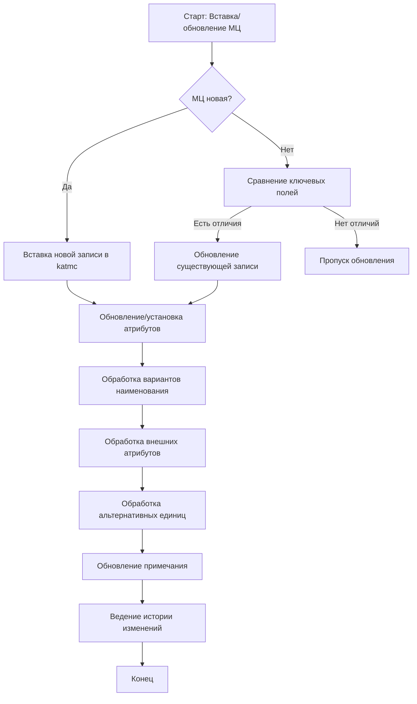

---

### ProcessOneMc

**Назначение:**
Обработка одной записи МЦ по идентификаторам сообщения и МЦ. Определяет, требуется ли создать новую запись или обновить существующую, и инициирует соответствующую обработку.

**Ключевые особенности:**
- Получает запись МЦ из внешней таблицы по MessageID и MDMID.
- Проверяет корректность входных параметров (CheckSHBDParams).
- В зависимости от настройки (UpdateOnlyOneMC) либо ищет одну МЦ, либо обрабатывает все с данным кодом.
- Если не найдено — пытается найти по NREC, иначе инициирует вставку новой записи.
- Ведет историю ошибок и событий.

**Поля, которые модифицируются:**
- Все поля, связанные с МЦ, через вызов INSERTMC.

**Mermaid-схема алгоритма:**
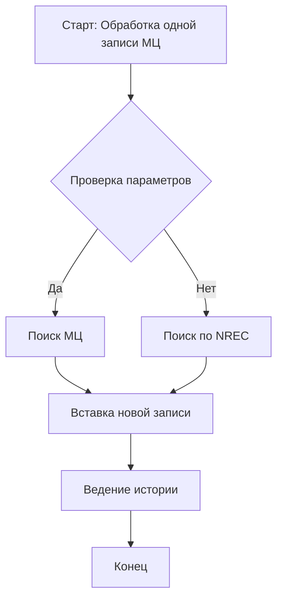

---

### FindGalMc

**Назначение:**
Поиск существующей МЦ в каталоге по различным признакам (код АСУ, штрихкоды, атрибуты). Определяет, новая ли МЦ, и возвращает найденную запись или признак необходимости создания новой.

**Ключевые особенности:**
- Сначала ищет по коду АСУ (MDMID).
- Если не найдено — ищет по штрихкодам (barkod, barkod2) или по атрибуту.
- Возвращает структуру МЦ и признак isMcNew.
- Ведет историю поиска и ошибок.

**Поля, которые модифицируются:**
- Не модифицирует, только ищет и возвращает.

**Mermaid-схема алгоритма:**
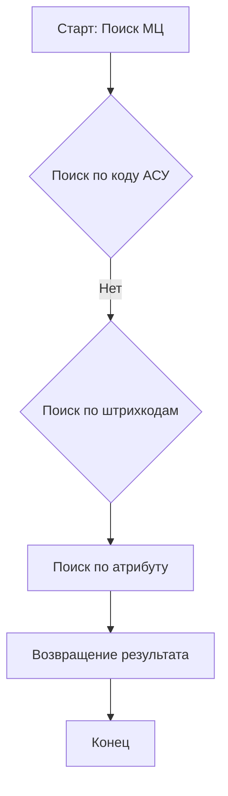

---

### CheckSHBDParams

**Назначение:**
Проверка корректности и полноты входных данных для МЦ перед обработкой. Фиксирует ошибки в истории и предотвращает дальнейшую обработку некорректных записей.

**Ключевые особенности:**
- Проверяет наличие MDMID, CLASS_ID, хотя бы одного наименования, OKEI.
- В случае ошибки — пишет в историю и возвращает false.

**Поля, которые модифицируются:**
- Не модифицирует, только проверяет.

**Mermaid-схема алгоритма:**
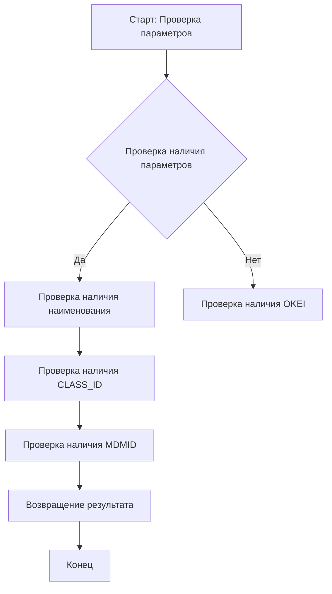

---

### CheckNameMC

**Назначение:**
Проверка уникальности наименования МЦ в каталоге в зависимости от настроек. Может либо выдавать предупреждение, либо запрещать дублирование.

**Ключевые особенности:**
- В зависимости от флагов ищет дубли по разным полям (barkod, barkod2, атрибут).
- При обнаружении дубликата — либо пишет предупреждение, либо запрещает вставку.
- Ведет историю событий.

**Поля, которые модифицируются:**
- Не модифицирует, только проверяет и пишет в историю.

**Mermaid-схема алгоритма:**
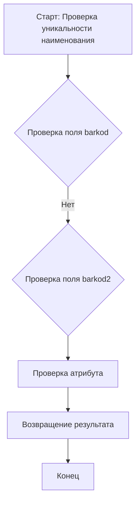

---

### LOAD_DATA

**Назначение:**
Основная процедура пакетной загрузки данных МЦ из внешней системы. Формирует список к обработке, итерирует по ним, вызывает обработку каждой МЦ, обновляет статусы, ведет историю.

**Ключевые особенности:**
- Формирует SQL-запрос для отбора новых записей.
- Инициализирует параметры импорта, настройки, шаблоны, массивы аналитик.
- Для каждой записи вызывает ProcessOneMc и UpdateStatus.
- Ведет историю, коммитит транзакции, обрабатывает ошибки.

**Поля, которые модифицируются:**
- Все поля, связанные с МЦ, через вызовы ProcessOneMc, INSERTMC и UpdateStatus.
- Статусы в erp12.mtr_pistatus.
- История изменений.

**Mermaid-схема алгоритма:**
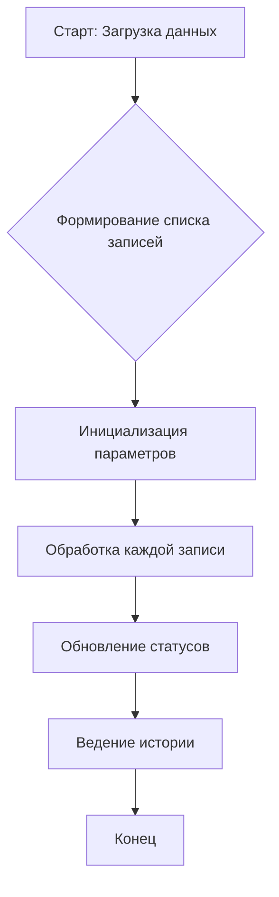

---

### GetHashAn

**Назначение:**
Получение или создание ссылки на "хэш аналитик" (hashan) для МЦ по набору значений аналитик. Используется для уникализации комбинаций аналитик в шаблоне.

**Ключевые особенности:**
- Формирует массив значений аналитик из записи МЦ.
- Для каждого блока (до 10 аналитик) ищет существующий hashan или создает новый.
- Использует вспомогательные функции: ParseShbdVal, FindAnVal, FindHashByAn.
- Возвращает ссылку на найденный или созданный hashan.

**Поля, которые модифицируются:**
- Вставка/обновление записей в erp12.hashan.

**Mermaid-схема алгоритма:**
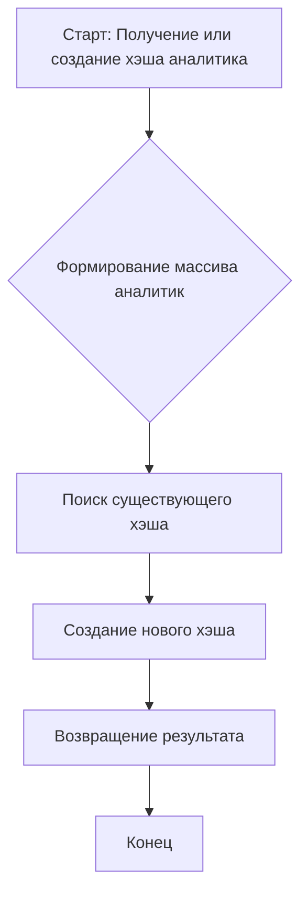

---

### FindHashByAn

**Назначение:**
Поиск существующего "хэша аналитик" (hashan) по значениям аналитик, шаблону и блоку. Если найден — возвращает ссылку, иначе null.

**Ключевые особенности:**
- Сравнивает значения аналитик по массиву.
- При нахождении — обновляет служебные поля.
- Возвращает ссылку на найденный hashan.

**Поля, которые модифицируются:**
- Может обновлять поля cblock, npp в erp12.hashan.

**Mermaid-схема алгоритма:**
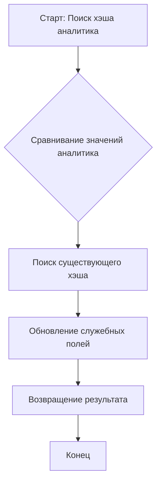

---

### GetAnVal

**Назначение:**
Поиск или создание значения аналитики (spkau) по параметрам. Если не найдено — создает новое значение, при необходимости с родителем.

**Ключевые особенности:**
- Если ValKod не задан — ищет по имени, иначе по коду.
- Если не найдено — создает новую запись, может отправлять уведомление.
- Ведет историю событий.

**Поля, которые модифицируются:**
- Вставка/обновление записей в erp12.spkau.

**Mermaid-схема алгоритма:**
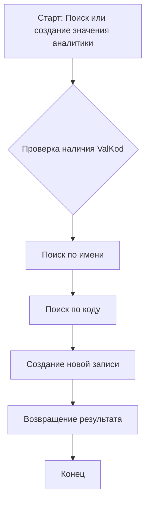

---

### CreateAnList / ParseTune / AddMaskAn / AddExtAn

**Назначение:**
Формирование массивов аналитик для шаблона и внешних атрибутов на основании настроек соответствия. Используются для автоматизации сопоставления аналитик при импорте.

**Ключевые особенности:**
- CreateAnList вызывает ParseTune для каждого типа аналитики.
- ParseTune определяет, какую аналитику добавить в шаблон или во внешние.
- AddMaskAn и AddExtAn добавляют аналитику в соответствующий массив.
- Используются при подготовке шаблона и обработке МЦ.

**Поля, которые модифицируются:**
- Массивы MaskAnList, ExtAnList.

**Mermaid-схема алгоритма:**
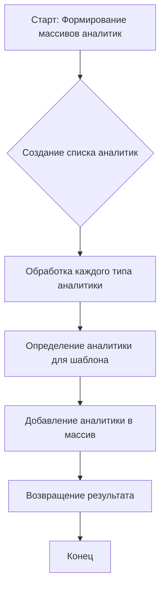

---

### PrepareMaskMC

**Назначение:**
Подготовка шаблона МЦ (maskmc) и массива аналитик для обработки записи. Определяет, какой шаблон использовать, и формирует массив аналитик.

**Ключевые особенности:**
- Получает шаблон по настройкам или по умолчанию.
- Заполняет поля ClassMap из шаблона.
- Определяет количество аналитик в шаблоне.
- Вызывает CreateAnList для формирования массива аналитик.

**Поля, которые модифицируются:**
- BufMask, MaskMc, ClassMap, KolAnInMask, MaxAn, MaskAnList.

**Mermaid-схема алгоритма:**
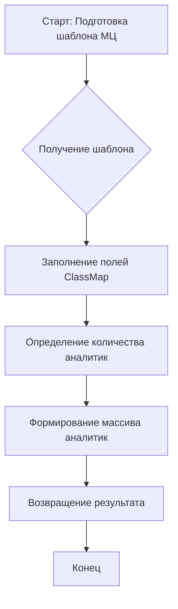

---

### GetKatEDByKodEI / GETKATED

**Назначение:**
Поиск или создание ссылки на единицу измерения (каталог ЕИ) по коду, имени или OKEI. Используются для сопоставления и вставки новых ЕИ при импорте.

**Ключевые особенности:**
- GetKatEDByKodEI ищет по коду и имени, при необходимости создает новую запись.
- GETKATED ищет по коду, если не найдено — вызывает GetKatEDByKodEI и связывает с атрибутом.
- Ведут историю событий.

**Поля, которые модифицируются:**
- Вставка/обновление записей в erp12.kated, erp12.attrval.

**Mermaid-схема алгоритма:**
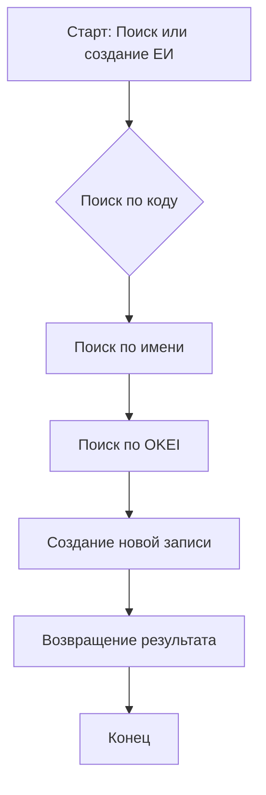

---

### CHECKOTPED / CheckAltEd / CheckAltEdWithKoeff

**Назначение:**
Проверка, добавление и обновление альтернативных (отпускных) единиц измерения для МЦ. Обеспечивают корректное сопоставление и поддержание актуальности отпускных ЕИ.

**Ключевые особенности:**
- CHECKOTPED ищет или добавляет отпускную ЕИ для МЦ, обновляет параметры при необходимости.
- CheckAltEd формирует массив необходимых отпускных ЕИ, добавляет новые, удаляет лишние.
- CheckAltEdWithKoeff учитывает коэффициенты пересчета между ЕИ.
- Ведут историю изменений.

**Поля, которые модифицируются:**
- Вставка/обновление/удаление записей в erp12.katotped.

**Mermaid-схема алгоритма:**
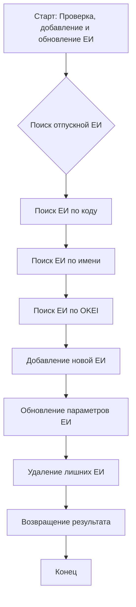

---

### ProcessNameVariant

**Назначение:**
Вставка или обновление варианта наименования МЦ в справочнике вариантов (`erp12.catalpsd`). Используется для поддержки нескольких вариантов наименования одной МЦ.

**Ключевые особенности:**
- Проверяет необходимость ведения вариантов наименований.
- Если вариант уже есть — обновляет примечание.
- Если нет — создает новый вариант с новым номером.
- Ведет историю изменений.

**Поля, которые модифицируются:**
- Вставка/обновление записей в erp12.catalpsd.

**Mermaid-схема алгоритма:**
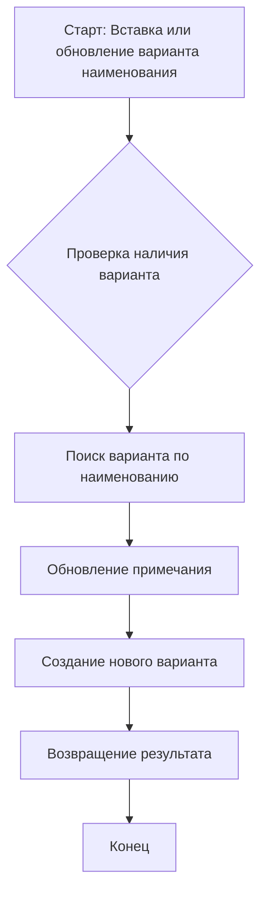

---

### GetMCGroupFromAn

**Назначение:**
Поиск или создание группы МЦ по строке группы и учетной ЕИ. Используется для сопоставления иерархии групп МЦ при импорте.

**Ключевые особенности:**
- Извлекает код и наименование группы из строки.
- Ищет существующую группу по коду или имени.
- Если не найдено — создает новую группу.
- При необходимости обновляет код группы.

**Поля, которые модифицируются:**
- Вставка/обновление записей в erp12.groupmc.

**Mermaid-схема алгоритма:**
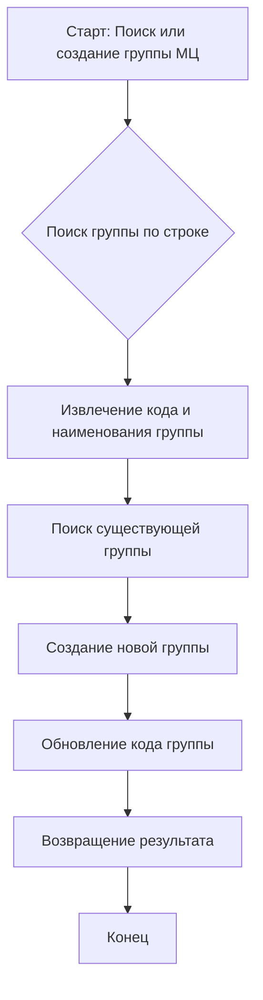

---

### UpdateStatus

**Назначение:**
Обновление статуса обработки записи в таблице статусов (`erp12.mtr_pistatus`) после обработки МЦ. Фиксирует успешную обработку или ошибку, ведет историю.

**Ключевые особенности:**
- В зависимости от наличия ошибок обновляет статус и описание.
- При необходимости коммитит транзакцию.
- Ведет историю изменений.

**Поля, которые модифицируются:**
- Обновление записей в erp12.mtr_pistatus.
- История изменений.

**Mermaid-схема алгоритма:**
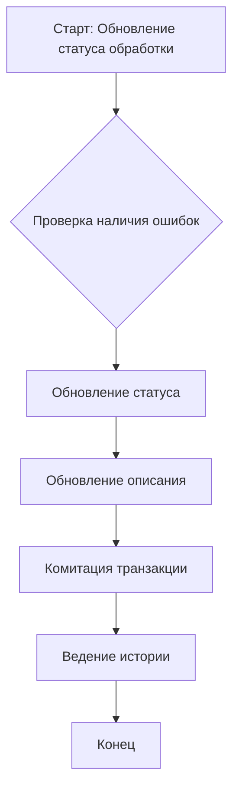

---

### CreateHistArc

**Назначение:**
Архивация старых записей истории (`erp12.nsihist`) в архивную таблицу (`erp12.nsihistarc`) по истечении заданного количества дней. Очищает основную таблицу истории.

**Ключевые особенности:**
- Определяет срок хранения истории по настройке.
- Переносит старые записи и их детали в архив.
- Удаляет архивированные записи из основной таблицы.

**Поля, которые модифицируются:**
- Вставка в erp12.nsihistarc, удаление из erp12.nsihist.

**Mermaid-схема алгоритма:**
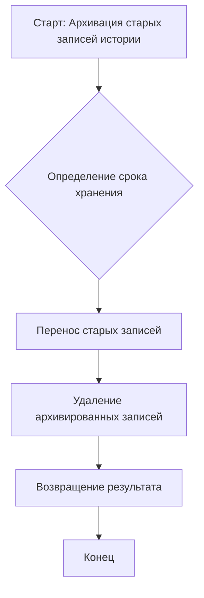

---

### ProcessExtAn

**Назначение:**
Установка значений внешних аналитик для МЦ. Используется для передачи дополнительных характеристик во внешние атрибуты.

**Ключевые особенности:**
- Для каждой внешней аналитики вычисляет значение и устанавливает его через SETATTRVAL.
- Ведет историю изменений.

**Поля, которые модифицируются:**
- Внешние атрибуты МЦ (через GalSys.SETATTRVAL).

**Mermaid-схема алгоритма:**
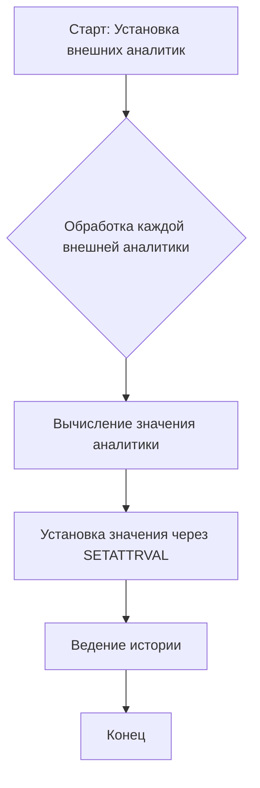

---

### RUnicode

**Назначение:**
Замена спецсимволов UNICODE в строке на стандартные символы. Используется для очистки наименований и других текстовых полей.

**Ключевые особенности:**
- Заменяет набор символов (например, ×, ±, – и др.) на аналоги (x, +, - и т.д.).
- Возвращает очищенную строку.

**Поля, которые модифицируются:**
- Не модифицирует, только возвращает преобразованную строку.

**Mermaid-схема алгоритма:**
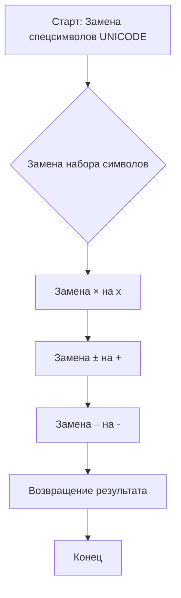

---

### GETMCNAME

**Назначение:**
Получение наименования МЦ по приоритету: длинное, среднее, короткое. Очищает строку от спецсимволов.

**Ключевые особенности:**
- Выбирает наименование по длине и наличию.
- Очищает строку через RUnicode.
- Возвращает строку нужной длины.

**Поля, которые модифицируются:**
- Не модифицирует, только возвращает строку.

**Mermaid-схема алгоритма:**
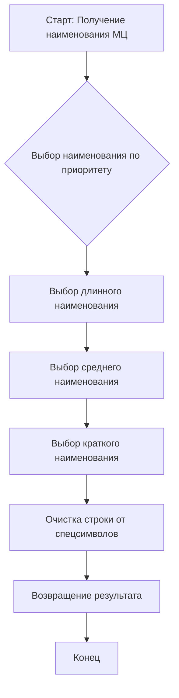

---

// Далее будут добавлены остальные функции и процедуры по аналогии. 
